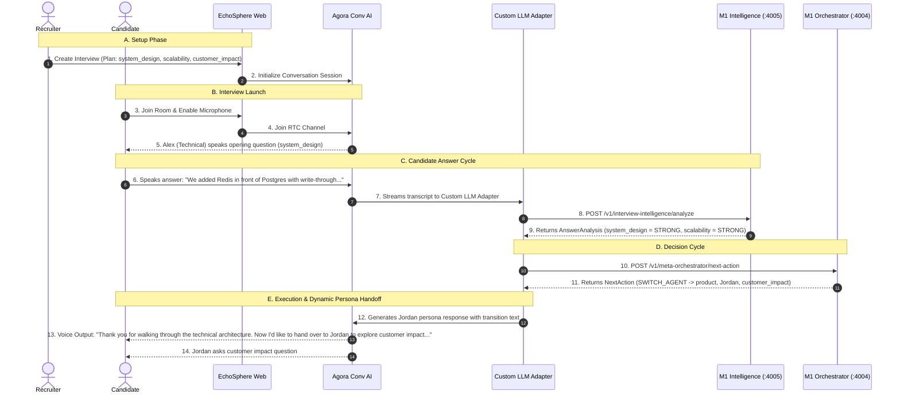
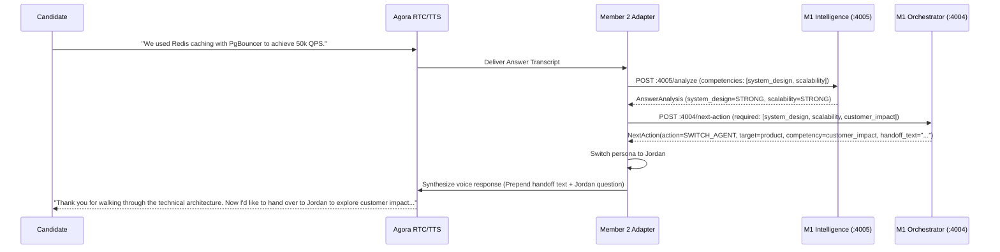
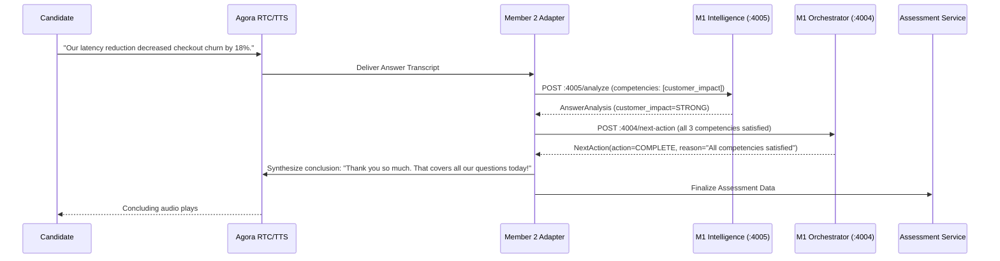

# EchoSphere V1 Specification — Single Reference Document

> **Status:** Canonical V1 Specification  
> **Target Audience:** Member 2 (Product, Frontend, Agora Conversational AI, Realtime Execution)  
> **Author:** EchoSphere Technical Architecture Team  
> **Integration Baseline:** Member 1 Implementation & Official Agora Conversational AI Starter  

---

## 1. V1 Objective

EchoSphere is an adaptive, multi-persona voice interview platform built on top of **Agora Conversational AI**. 

Its core differentiator is the **adaptive intelligence loop**: rather than running a static script of questions, EchoSphere continuously evaluates candidate answers against job competencies, extracts grounded evidence, detects gaps or contradictions, adjusts question difficulty, and dynamically switches interviewer personas (e.g., Technical Interviewer Alex $\to$ Product Lead Jordan) within a single continuous voice session.

```text
Recruiter creates interview & configures JD/Competencies
       ↓
Candidate enters voice interview room
       ↓
Agora Conversational AI conducts realtime voice interaction
       ↓
Candidate speaks answer
       ↓
Answer transcript reaches EchoSphere Intelligence (:4005)
       ↓
Intelligence returns AnswerAnalysis (evidence, scoring, confidence, vagueness)
       ↓
Meta-Orchestrator (:4004) processes context & returns NextAction
       ↓
Member 2 executes NextAction via Custom LLM Adapter / Agora runtime
       ↓
Active interviewer continues probe OR hands off to next persona
       ↓
Interview concludes automatically when competency coverage is complete
       ↓
Recruiter views evidence-backed Assessment Report
```

### In-Scope for V1
- Full candidate voice interview powered by Agora Conversational AI.
- Dynamic persona adaptation (Alex $\to$ Jordan) in a single continuous audio session.
- Grounded competency evidence extraction and scoring by Member 1.
- Deterministic LangGraph meta-orchestration for next-action decisions.
- Realtime Custom LLM Adapter bridging Agora and EchoSphere orchestration.
- Recruiter job/competency setup and post-interview evidence-backed assessment report.

### Intentionally Deferred Beyond V1
- Multi-party simultaneous voice sessions (multiple concurrent Agora RTC voice agents speaking at once).
- TEN Framework integration (Agora Conversational AI REST/RTC APIs are used directly).
- Production microservices infrastructure (Kafka, Kubernetes, Redis cluster, distributed event buses).
- Automated CV parsing ML models (simple JSON/structured profile input is used for V1).
- Complex enterprise RBAC and multi-tenant billing.

---

## 2. V1 Architecture

```text
                         RECRUITER
                             │
                             ▼
                    EchoSphere Web (Next.js)
                             │
          ┌──────────────────┼──────────────────┐
          ▼                  ▼                  ▼
      Candidate          Job / Plan         Assessment
       Context             Config             Report
          └──────────────────┬──────────────────┘
                             ▼
                     Interview Session
                             │
                             ▼
             ╔══════════════════════════════╗
             ║   AGORA CONVERSATIONAL AI    ║
             ║   (Realtime Voice Runtime)   ║
             ║   RTC Audio Stream / STT     ║
             ╚═══════════╤══════════════════╝
                         │ Candidate Transcript / Answer
                         ▼
             ┌──────────────────────────────┐
             │ Interview Intelligence (M1)  │
             │ Port: 4005                   │
             └───────────┬──────────────────┘
                         │ AnswerAnalysis
                         ▼
             ┌──────────────────────────────┐
             │ Meta-Orchestrator (M1)       │
             │ LangGraph — Port: 4004       │
             └───────────┬──────────────────┘
                         │ NextAction
                         ▼
             ┌──────────────────────────────┐
             │ Custom LLM Adapter           │
             │ (Agora ↔ EchoSphere Bridge)  │
             └───────────┬──────────────────┘
                         │ Active Persona Directive
                ┌────────┴────────┐
                ▼                 ▼
          Alex (Technical)  Jordan (Product)
                └────────┬────────┘
                         │ Generated Persona Utterance
                         ▼
             ╔══════════════════════════════╗
             ║   AGORA CONVERSATIONAL AI    ║
             ║   TTS Synthesis / RTC Stream ║
             ╚═══════════╤══════════════════╝
                         │ Audio Playback
                         ▼
                     CANDIDATE
```

### Component Responsibility Breakdown

| Component | Port / Runtime | Primary Responsibility | Owner |
|---|---|---|---|
| **Agora Conversational AI** | Cloud / SDK | Realtime RTC audio transport, ASR (Speech-to-Text), and TTS (Text-to-Speech). | Agora / Member 2 |
| **Interview Intelligence** | `http://localhost:4005` | Evaluates candidate answers, extracts grounded evidence, evaluates competencies, detects vagueness & contradictions. | **Member 1** |
| **Meta-Orchestrator** | `http://localhost:4004` | LangGraph state machine deciding the next interview action (`NextAction`). | **Member 1** |
| **Custom LLM Adapter** | Application Endpoint | Bridge receiving Agora LLM requests, querying M1, and formatting persona prompt directives. | **Member 2** |
| **Interview Session** | Next.js Server / API | Manages logical interview lifecycle, preserves `InterviewAIContext`, and coordinates Agora tokens. | **Member 2** |
| **EchoSphere Web** | Next.js / React | Recruiter configuration UI, candidate live interview screen, and recruiter assessment report. | **Member 2** |

---

## 3. Team Ownership Matrix

```text
┌────────────────────────────────────────────────────────────────────────┐
│                       MEMBER 1 RESPONSIBILITY                          │
│               "What should happen next in the interview?"               │
│                                                                        │
│  • Interview Intelligence Engine (:4005)                                │
│  • AnswerAnalysis & Evidence extraction                                │
│  • Competency scoring & confidence calculation                         │
│  • Vagueness & Contradiction detection                                 │
│  • LangGraph Meta-Orchestrator (:4004)                                 │
│  • Deterministic policies (Completion, Handoff, Gap Priority)          │
│  • NextAction generation and ActionValidator                           │
│  • Deterministic TransitionBuilder for voice handoffs                   │
│  • Frozen canonical domain contracts & Python backend                  │
└──────────────────────────────────┬─────────────────────────────────────┘
                                   │ NextAction + AnswerAnalysis Contracts
                                   ▼
┌────────────────────────────────────────────────────────────────────────┐
│                       MEMBER 2 RESPONSIBILITY                          │
│           "How do we execute that decision through Agora & UI?"         │
│                                                                        │
│  • Next.js App Router frontend (Recruiter + Candidate live screen)     │
│  • Agora Conversational AI SDK / RTC audio session lifecycle           │
│  • Custom LLM Adapter (translates NextAction into persona utterances)  │
│  • Persona handoff execution within the continuous audio session       │
│  • Session state management & InterviewAIContext persistence           │
│  • Calling M1 POST /analyze and POST /next-action                      │
│  • Recruiter assessment report visualization                           │
└────────────────────────────────────────────────────────────────────────┘
```

> [!CRITICAL]
> **Member 2 Rule:** Member 2 **MUST NOT** reimplement orchestration, scoring, or gap-prioritization logic in the frontend or Custom LLM Adapter. Member 2 passes `InterviewAIContext` and candidate transcripts to Member 1 and executes the returned `NextAction`.

---

## 4. V1 End-to-End User Flow



### Flow Breakdown:
1. **Recruiter Setup:** Recruiter selects required competencies (`system_design`, `scalability`, `customer_impact`) and assigns personas (`technical` $\to$ Alex, `product` $\to$ Jordan).
2. **Candidate Entry:** Candidate opens the live link, authorizes microphone, and connects to Agora RTC.
3. **Turn 1 (Alex - Technical):** Alex asks about database and caching architecture. Candidate provides strong technical answer.
4. **Intelligence Analysis:** Candidate answer is sent to `POST :4005/analyze`. Member 1 extracts evidence and rates `system_design` and `scalability` as `STRONG`.
5. **Orchestrator Decision:** Orchestrator identifies that technical competencies are satisfied, but `customer_impact` remains unevaluated. It returns:
   ```json
   {
     "action": "SWITCH_AGENT",
     "target_agent_id": "product",
     "competency_id": "customer_impact",
     "handoff_transition_text": "Thank you for walking through the technical architecture. Now I'd like to hand over to Jordan to explore the customer impact and business implications."
   }
   ```
6. **Persona Handoff Execution:** Member 2's Custom LLM Adapter switches active persona instructions to Jordan, speaks the transition text, and poses the customer impact question.
7. **Candidate Experience:** The candidate hears a seamless, natural transition between two colleagues within the exact same audio session.

---

## 5. Canonical AI Domain Contracts

The canonical contracts implemented by Member 1 are frozen and must be used exactly as specified.

### 5.1 Enums

```python
ActionType = "ASK_QUESTION" | "SWITCH_AGENT" | "COMPLETE"
DifficultyLevel = "EASY" | "MEDIUM" | "HARD"
PerformanceRating = "STRONG" | "PARTIAL" | "WEAK" | "NOT_EVALUATED"
EvidenceStrength = "STRONG" | "MODERATE" | "WEAK"
AgentRole = "Technical Interviewer" | "Product Lead" | "System Designer" | "Hiring Manager"
```

> [!IMPORTANT]
> - `ActionType` contains ONLY: `ASK_QUESTION`, `SWITCH_AGENT`, `COMPLETE`.
> - Clarifications (vagueness or contradictions) return `ASK_QUESTION` with an explicit `prompt_directive`.
> - `difficulty` is metadata on `NextAction`, not a separate action type.

---

### 5.2 Schemas & Payloads

#### `EvidenceItem`
```json
{
  "evidence_id": "EVID-ANS-001-001",
  "answer_id": "ANS-001",
  "competency_id": "system_design",
  "statement": "We placed Redis in front of PostgreSQL with write-through caching.",
  "strength": "STRONG",
  "timestamp": "2026-09-02T20:30:00.000000Z"
}
```

#### `CompetencyFinding`
```json
{
  "competency_id": "system_design",
  "assessment": "STRONG",
  "confidence": 0.91,
  "evidence_ids": ["EVID-ANS-001-001"]
}
```

#### `AnswerAnalysis` (Returned by Port 4005)
```json
{
  "answer_id": "ANS-001",
  "overall_performance": "STRONG",
  "confidence": 0.91,
  "vague": false,
  "vague_reason": null,
  "contradiction_detected": false,
  "contradiction_details": null,
  "missing_information": ["customer_impact"],
  "evidence": [
    {
      "evidence_id": "EVID-ANS-001-001",
      "answer_id": "ANS-001",
      "competency_id": "system_design",
      "statement": "We placed Redis in front of PostgreSQL with write-through caching.",
      "strength": "STRONG",
      "timestamp": "2026-09-02T20:30:00.000000Z"
    }
  ],
  "competency_findings": [
    {
      "competency_id": "system_design",
      "assessment": "STRONG",
      "confidence": 0.91,
      "evidence_ids": ["EVID-ANS-001-001"]
    }
  ],
  "recommended_follow_up": "Probe deeper edge cases or scale trade-offs."
}
```

#### `NextAction` (Returned by Port 4004)
```json
{
  "action": "SWITCH_AGENT",
  "target_agent_id": "product",
  "competency_id": "customer_impact",
  "difficulty": "HARD",
  "reason": "Candidate has coverage for previous area; 'customer_impact' belongs to Jordan (Product Lead).",
  "prompt_directive": "Introduce and probe customer impact.",
  "handoff_transition_text": "Thank you for walking through the technical architecture. Now I'd like to hand over to Jordan to explore the customer impact and business implications."
}
```

#### `InterviewAIContext` (Authoritative Domain State maintained by Member 2)
```json
{
  "interview_id": "INT-101",
  "candidate_id": "CAND-505",
  "current_round_id": "ROUND-001",
  "current_agent_id": "technical",
  "difficulty": "MEDIUM",
  "evaluated_competencies": {
    "system_design": "STRONG",
    "scalability": "STRONG"
  },
  "accumulated_evidence": [
    {
      "evidence_id": "EVID-ANS-001-001",
      "answer_id": "ANS-001",
      "competency_id": "system_design",
      "statement": "We placed Redis in front of PostgreSQL with write-through caching.",
      "strength": "STRONG",
      "timestamp": "2026-09-02T20:30:00.000000Z"
    }
  ],
  "open_questions": [],
  "missing_competencies": ["customer_impact"],
  "detected_contradictions": []
}
```

---

### 5.3 API Endpoints

#### 1. Interview Intelligence Service (`Port 4005`)
- **Health Check:** `GET /health` $\to$ `{"status": "healthy", "service": "interview-intelligence", "port": 4005, "version": "0.1.0"}`
- **Analyze Answer:** `POST /analyze` (or `POST /v1/interview-intelligence/analyze`)
  - **Request Body:**
    ```json
    {
      "question": "How do you scale high-throughput API endpoints?",
      "candidate_answer": "We added Redis in front of PostgreSQL and implemented write-through caching.",
      "target_competencies": ["system_design", "scalability"],
      "interview_context": { ... },
      "answer_id": "ANS-001",
      "candidate_profile_summary": null
    }
    ```
  - **Response (200 OK):** `AnswerAnalysis`

#### 2. Meta-Orchestrator Service (`Port 4004`)
- **Health Check:** `GET /health` $\to$ `{"status": "healthy", "service": "meta-orchestrator", "port": 4004, "version": "0.1.0"}`
- **Decide Next Action:** `POST /next-action` (or `POST /v1/meta-orchestrator/next-action`)
  - **Request Body:**
    ```json
    {
      "interview_context": { ... },
      "answer_analysis": { ... },
      "required_competencies": ["system_design", "scalability", "customer_impact"],
      "is_final_round": false,
      "current_competency": "system_design"
    }
    ```
  - **Response (200 OK):** `NextAction`

---

## 6. Member 2 Integration Protocol

Between interview turns, Member 2's backend must persist and update `InterviewAIContext`:

```text
Turn Start (Question asked)
    │
    ▼
Candidate answers via Agora Voice
    │
    ▼
Receive final transcript string from Agora
    │
    ▼
Call Member 1 Intelligence:
POST http://localhost:4005/v1/interview-intelligence/analyze
    │
    ▼
Receive AnswerAnalysis
    │
    ├── Update context: context.accumulated_evidence.extend(analysis.evidence)
    ├── Update context: context.evaluated_competencies.update(analysis findings)
    │
    ▼
Call Member 1 Meta-Orchestrator:
POST http://localhost:4004/v1/meta-orchestrator/next-action
    │
    ▼
Receive NextAction
    │
    ├── Update context: context.current_agent_id = next_action.target_agent_id
    ├── Update context: context.difficulty = next_action.difficulty or context.difficulty
    │
    ▼
Pass NextAction to Custom LLM Adapter -> Agora TTS speaks next turn
```

### Turn State Preservation Requirements
Member 2 must preserve:
1. `interview_id` and `candidate_id`
2. `current_agent_id` (updated when `SWITCH_AGENT` is executed)
3. `difficulty` (updated from `next_action.difficulty`)
4. `evaluated_competencies` (merged from `competency_findings`)
5. `accumulated_evidence` (appended from `analysis.evidence`)
6. `detected_contradictions` (appended if `analysis.contradiction_detected` is true)

---

## 7. Custom LLM Adapter Specification

The **Custom LLM Adapter** is an HTTP/streaming endpoint running in Member 2's backend. When Agora Conversational AI receives candidate speech, it calls this adapter to get the LLM response.

### Adapter Responsibilities
1. Receive conversational turn request from Agora.
2. If the request represents a candidate answer to an interview question:
   - Call M1 `POST :4005/analyze`
   - Call M1 `POST :4004/next-action`
3. Assemble prompt context for the LLM:
   - **Active Persona Instructions:** (Alex or Jordan system prompt)
   - **Orchestrator Directive:** `next_action.prompt_directive`
   - **Handoff Transition Text:** If `next_action.action == "SWITCH_AGENT"`, prepend `next_action.handoff_transition_text` to the assistant response.
   - **Compact Turn History:** Recent 2-3 turns.
4. Call standard LLM (e.g. GPT-4o / Claude / Gemini) to synthesize the spoken response.
5. Stream the response back to Agora in the format required by Agora's CustomLLM interface.

### Handling `NextAction.action` Types

#### 1. `ASK_QUESTION`
- Keep active persona unchanged.
- Supply `next_action.prompt_directive` to guide the LLM's next probe.
- LLM outputs the follow-up question.

#### 2. `SWITCH_AGENT`
- Update active persona to `next_action.target_agent_id` (e.g., `product`).
- Prepend `next_action.handoff_transition_text` to the synthesized dialogue.
- Use new persona instructions (Jordan) to ask the first question for `next_action.competency_id`.

#### 3. `COMPLETE`
- Instruct LLM to gracefully thank the candidate and state that the interview has concluded.
- Signal the UI and Agora session to gracefully end the call.

---

## 8. Agora Integration Architecture

EchoSphere V1 uses the **Official Agora Conversational AI Starter** as its baseline.

```text
┌─────────────────────────────────────────────────────────────┐
│                 AGORA CONVERSATIONAL AI                     │
│                                                             │
│  ┌─────────────────┐    ┌────────────────┐    ┌──────────┐  │
│  │   Agora RTC     │───►│   Agora ASR    │───►│  Custom  │  │
│  │  (Microphone)   │    │ (Transcription)│    │   LLM    │  │
│  └─────────────────┘    └────────────────┘    │ Adapter  │  │
│                                               └────┬─────┘  │
│  ┌─────────────────┐    ┌────────────────┐         │        │
│  │   Agora RTC     │◄───│   Agora TTS    │◄────────┘        │
│  │   (Speaker)     │    │  (Synthesis)   │                  │
│  └─────────────────┘    └────────────────┘                  │
└─────────────────────────────────────────────────────────────┘
```

### Key Integration Rules:
1. **Single RTC Channel:** The candidate joins one Agora RTC channel. Persona transitions occur dynamically over this same channel.
2. **Custom LLM Configuration:** Configure the Agora Conversational AI agent to use Member 2's `Custom LLM URL`.
3. **Session Lifecycle:** Member 2 manages token generation (`/api/agora/token`), starting the agent (`/api/agora/start`), and stopping the agent (`/api/agora/stop`).
4. **No TEN Required:** Direct REST / RTC integration with Agora Conversational AI is used.

---

## 9. Persona Definitions

Member 1 defines two canonical personas preloaded in `AgentRegistry`:

### 1. Alex — Technical Interviewer (`agent_id: "technical"`)
- **Display Name:** Alex
- **Role:** Technical Interviewer
- **Focal Competencies:** `system_design`, `scalability`
- **Questioning Style:** Deep technical architectural probe, trade-offs, bottlenecks, failure modes.
- **System Instructions:** *"You are Alex, an engineering leader evaluating system architecture and scalability. You probe technical choices, databases, caching, and distributed systems."*

### 2. Jordan — Product Lead (`agent_id: "product"`)
- **Display Name:** Jordan
- **Role:** Product Lead
- **Focal Competencies:** `customer_impact`
- **Questioning Style:** Customer empathy, product trade-offs, business metrics, user experience.
- **System Instructions:** *"You are Jordan, a product leader evaluating customer value, business metrics, user adoption, and cross-functional alignment."*

---

## 10. Interview State Machine

```text
┌──────────────────┐
│ INTERVIEW_CREATED│  (Recruiter configures JD & Competencies)
└────────┬─────────┘
         │
         ▼
┌──────────────────┐
│      READY       │  (Candidate enters waiting room & verifies microphone)
└────────┬─────────┘
         │
         ▼
┌──────────────────┐
│   IN_PROGRESS    │◄────────────────────────┐
└────────┬─────────┘                         │
         │ Candidate speaks answer           │
         ▼                                   │
┌──────────────────┐                         │
│    ANALYZING     │  (Member 1 :4005)       │
└────────┬─────────┘                         │
         │ AnswerAnalysis returned           │
         ▼                                   │
┌──────────────────┐                         │
│     DECIDING     │  (Member 1 :4004)       │
└────────┬─────────┘                         │
         │ NextAction returned               │
         ▼                                   │
┌──────────────────┐                         │
│ EXECUTING_ACTION │  (Custom LLM / Agora)   │
└────────┬─────────┘                         │
         │                                   │
         ├── ASK_QUESTION / SWITCH_AGENT ────┘
         │
         └── COMPLETE
                 │
                 ▼
         ┌───────────────┐
         │   COMPLETED   │  (Assessment Report generated)
         └───────────────┘
```

---

## 11. Frontend V1 Requirements (Next.js)

### Recruiter Views
1. **Interview Setup (`/recruiter/interviews/new`):**
   - Job title & description input.
   - Target competencies selector (`system_design`, `scalability`, `customer_impact`).
   - Persona assignment preview (Alex $\to$ technical, Jordan $\to$ product).
   - "Generate Candidate Link" action.
2. **Assessment Report (`/recruiter/interviews/[id]/report`):**
   - Overall rating badge (`STRONG` / `PARTIAL` / `WEAK`).
   - Competency score cards with confidence levels.
   - Grounded evidence statements list.
   - Contradiction / vagueness flags log.
   - Full interview transcript timeline.

### Candidate Views
1. **Welcome & Mic Check (`/candidate/interview/[id]`):**
   - Candidate details confirmation.
   - Audio input permission check & visual mic volume meter.
   - "Start Interview" button.
2. **Live Voice Interview Room (`/candidate/interview/[id]/live`):**
   - Active interviewer badge: Shows active persona avatar, name (`Alex` or `Jordan`), and role.
   - Realtime audio visualizer / orb animation.
   - Status indicator (`Listening`, `Thinking`, `Speaking`).
   - "End Call" button.
3. **Completion Screen (`/candidate/interview/[id]/complete`):**
   - Polite thank-you message confirming submission.

---

## 12. Sequence Diagrams

### 12.1 Dynamic Persona Switch (Alex $\to$ Jordan)



### 12.2 Interview Completion



---

## 13. Error Handling & Safe Fallbacks

| Failure Scenario | Fallback Behavior | Impact |
|---|---|---|
| **Intelligence API (:4005) down / timeout** | Fallback to default `PARTIAL` rating with `0.5` confidence; log warning; proceed with next planned question. | Prevents interview freeze; preserves conversational flow. |
| **Meta-Orchestrator (:4004) down / timeout** | Fallback to `ActionType.ASK_QUESTION` on current agent with general prompt directive. | Candidate experiences normal follow-up without persona crash. |
| **Unknown `target_agent_id` returned** | `ActionValidator` catches error; fallback to current active agent persona. | Safe continuous interview. |
| **Agora RTC Disconnect / Reconnect** | Preserve `InterviewAIContext` on server; resume active persona upon reconnection. | Session resilience across network blips. |
| **Candidate Silence / Empty Transcript** | Adapter prompts: *"I didn't catch that, could you please repeat or elaborate?"* | Natural conversational recovery. |

---

## 14. Canonical V1 Demo Scenario (Acceptance Test)

The canonical demo proving adaptive multi-persona voice orchestration:

1. Recruiter creates interview with 3 competencies: `system_design`, `scalability`, `customer_impact`.
2. Candidate joins live voice room. Active persona displays **Alex (Technical Interviewer)**.
3. Alex introduces himself and asks: *"How do you design your database and caching tier for high-throughput reads?"*
4. Candidate answers: *"We put Redis in front of PostgreSQL with write-through caching to keep latencies under 5ms."*
5. Intelligence (:4005) extracts grounded evidence and scores `system_design` as `STRONG`.
6. Orchestrator (:4004) determines `system_design` is satisfied, but `scalability` is missing $\to$ returns `ASK_QUESTION` for `scalability` with difficulty `HARD`.
7. Alex asks: *"How did you scale this to handle 50,000 requests per second under peak load?"*
8. Candidate answers: *"We used horizontal auto-scaling on ECS and configured Redis sharding with PgBouncer."*
9. Intelligence (:4005) evaluates `scalability` as `STRONG`.
10. Orchestrator (:4004) determines all technical competencies are satisfied, but `customer_impact` remains unaddressed $\to$ returns `SWITCH_AGENT` to **product** (Jordan).
11. Member 2 executes persona transition. UI updates active persona to **Jordan (Product Lead)**.
12. Jordan speaks transition: *"Thank you for walking through the technical architecture. Now I'd like to hand over to Jordan to explore the customer impact and business implications."*
13. Jordan asks: *"What was the direct impact on user conversion and checkout latency?"*
14. Candidate answers: *"Checkout drop-off decreased by 18%, and 99th percentile load time dropped to 180ms."*
15. Intelligence (:4005) evaluates `customer_impact` as `STRONG`.
16. Orchestrator (:4004) returns `COMPLETE`. Jordan concludes the interview.
17. Recruiter views report showing 3 `STRONG` competencies, grounded evidence quotes, and full transcript.

---

## 15. V1 Acceptance Criteria

- [x] Candidate can complete a full voice interview using Agora Conversational AI.
- [x] Candidate voice answers are transcribed and sent to Member 1 (`:4005/analyze`).
- [x] Member 1 produces structured `AnswerAnalysis` with grounded evidence items and confidence.
- [x] Meta-Orchestrator (`:4004/next-action`) returns validated `NextAction` (`ASK_QUESTION`, `SWITCH_AGENT`, `COMPLETE`).
- [x] `SWITCH_AGENT` seamlessly changes active persona from Alex $\to$ Jordan within the **same continuous audio session**.
- [x] Candidate experience feels like one coherent interview with two natural interviewers.
- [x] `InterviewAIContext` is accurately updated and preserved across turns.
- [x] Recruiter assessment report visualizes overall rating, competency breakdown, evidence quotes, and contradiction logs.
- [x] Zero duplicate orchestration rules in Member 2 backend/frontend.

---

## 16. V1 Non-Goals

- **TEN Framework:** Out of scope. Standard Agora Conversational AI REST/RTC APIs are used.
- **Multiple Concurrent Audio Streams:** No simultaneous voice RTC agents speaking at once; one active persona speaks at any given turn.
- **Microservices & Message Brokers:** No Kafka, Kubernetes, or Redis clusters.
- **Custom ML Model Training:** No fine-tuning or custom speech models.
- **Autonomous Unconstrained Routing:** Personas follow the deterministic interview plan and LangGraph decisions.

---

## 17. Step-by-Step Implementation Order for Member 2

### Phase 1: Agora Voice Foundation
- **Build:** Clone and configure official Agora Conversational AI Next.js starter.
- **Verify:** Verify two-way voice conversation (microphone $\to$ Agora $\to$ TTS audio output).

### Phase 2: Recruiter Setup UI
- **Build:** Job description and competency selection screen (`/recruiter/interviews/new`).
- **Verify:** Form submission creates an interview record with required competencies `["system_design", "scalability", "customer_impact"]`.

### Phase 3: Candidate Live Screen
- **Build:** Live room UI (`/candidate/interview/[id]/live`) with active persona badge (Alex/Jordan) and audio orb.
- **Verify:** UI displays active persona and mic status.

### Phase 4: Intelligence Integration
- **Build:** Integrate `POST http://localhost:4005/v1/interview-intelligence/analyze`.
- **Verify:** Sending sample transcript returns `AnswerAnalysis` JSON.

### Phase 5: Meta-Orchestrator Integration
- **Build:** Integrate `POST http://localhost:4004/v1/meta-orchestrator/next-action`.
- **Verify:** Sending context + analysis returns `NextAction` JSON.

### Phase 6: Custom LLM Adapter
- **Build:** Implement Custom LLM endpoint connecting Agora Conversational AI to M1 APIs.
- **Verify:** Agora LLM requests invoke M1 and output synthesized persona utterances.

### Phase 7: Persona Handoff Execution (`SWITCH_AGENT`)
- **Build:** Handle `action == "SWITCH_AGENT"`. Update active persona avatar/name and speak handoff dialogue.
- **Verify:** Handoff from Alex $\to$ Jordan occurs smoothly in the same audio call.

### Phase 8: Interview Completion (`COMPLETE`)
- **Build:** Handle `action == "COMPLETE"`. Gracefully conclude call and redirect to report.
- **Verify:** Call ends automatically when all competencies are satisfied.

### Phase 9: Recruiter Assessment Report
- **Build:** Report dashboard (`/recruiter/interviews/[id]/report`) displaying `evaluated_competencies` and `accumulated_evidence`.
- **Verify:** Report displays all extracted evidence quotes and ratings.

### Phase 10: End-to-End Dry Run
- **Build:** Execute full 3-turn canonical demo scenario.
- **Verify:** Verify complete loop from voice input to final report.

---

## 18. Member 2 Integration Checklist

```markdown
[ ] 1. Clone and run official Agora Conversational AI starter
[ ] 2. Verify microphone input and Agora TTS audio playback
[ ] 3. Launch Member 1 services: `python -m src.api.app --service all`
[ ] 4. Verify M1 health: GET http://localhost:4005/health and GET http://localhost:4004/health
[ ] 5. Implement Recruiter Setup UI with competency plan
[ ] 6. Implement Candidate Live Room with active persona indicator (Alex / Jordan)
[ ] 7. Implement Custom LLM Adapter endpoint for Agora
[ ] 8. Connect candidate answer transcript to POST http://localhost:4005/analyze
[ ] 9. Parse AnswerAnalysis and update InterviewAIContext
[ ] 10. Connect context to POST http://localhost:4004/next-action
[ ] 11. Execute ASK_QUESTION (same persona follow-up)
[ ] 12. Execute SWITCH_AGENT (Alex -> Jordan handoff with transition text)
[ ] 13. Execute COMPLETE (conclude interview and close session)
[ ] 14. Render Recruiter Assessment Report with evidence quotes
[ ] 15. Complete full canonical demo scenario test
```

---

## 19. Core Architectural Rules for V1

1. **Member 1 decides WHAT happens next.**
2. **Member 2 decides HOW that decision is executed through Agora and UI.**
3. **Agora Conversational AI is the realtime voice transport and conversational runtime.**
4. **The Custom LLM Adapter bridges Agora to EchoSphere orchestration.**
5. **Do NOT duplicate orchestration rules in Member 2 backend or frontend.**
6. **Do NOT introduce additional ActionTypes (use only `ASK_QUESTION`, `SWITCH_AGENT`, `COMPLETE`).**
7. **TEN Framework is OUT OF SCOPE.**
8. **Keep the candidate experience as ONE continuous interview call.**
9. **Preserve and update `InterviewAIContext` across all turns.**
10. **Grounded evidence and explainability always take precedence over ungrounded claims.**

---

## 20. Inter-Member Collaboration & Contracts

### What Member 2 Needs From Member 1:
1. Running Python backend services on ports `4005` (Intelligence) and `4004` (Meta-Orchestrator).
2. Canonical REST contracts: `POST /analyze` and `POST /next-action`.
3. Deterministic `handoff_transition_text` for persona handoffs.
4. Stable persona definitions (`Alex` and `Jordan`).

### What Member 1 Needs From Member 2:
1. Accurate, transcribed candidate answer strings from Agora ASR.
2. Preserved and updated `InterviewAIContext` passed on each turn.
3. Strict execution of `NextAction` without overriding or modifying action types.
4. Clean session closure upon `ActionType.COMPLETE`.

### V1 Integration Blockers & Mitigations:
- **Blocker:** Agora CustomLLM API payload format mismatch.  
  *Mitigation:* Custom LLM Adapter adapts Agora request/response envelopes directly while keeping M1 contracts clean.
- **Blocker:** Network latency during audio turns.  
  *Mitigation:* M1 evaluation is optimized ($<100\text{ms}$ deterministic response time) to keep voice latency low.
