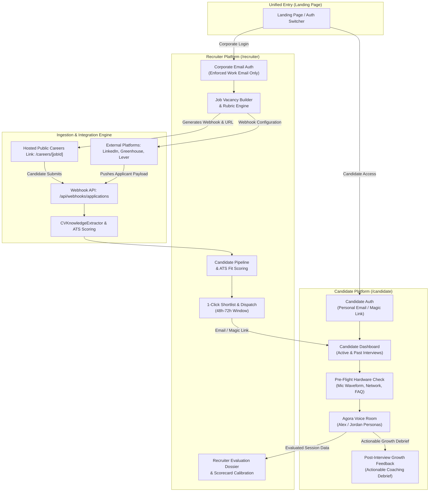
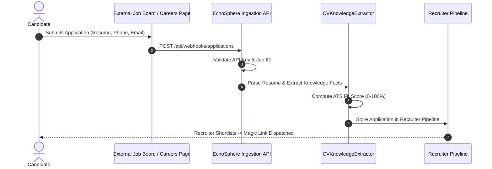
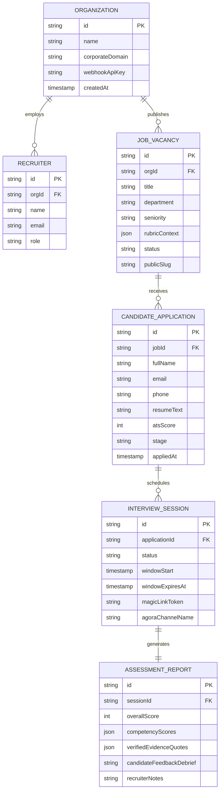

# EchoSphere Dual-Platform Architecture & Implementation Guide (`dualplatform.md`)

## 1. Executive Summary

EchoSphere is evolving from a single-session demonstration tool into a **two-sided hiring operating system**:
1. **Recruiter Portal (`/recruiter`)**: Enterprise-grade talent operations suite requiring verified corporate work emails, featuring job vacancy creation, external job board/ATS ingestion webhooks, automated ATS candidate scoring, voice interview dispatching with completion deadlines, and calibrated scorecard evaluation.
2. **Candidate Portal (`/candidate`)**: Frictionless personal workspace accessible via personal email or magic link, featuring an interview rounds dashboard, pre-flight hardware/network diagnostic room, full-duplex Agora voice interview execution within scheduled time windows, and transparent post-interview career growth debriefs.

---

## 2. High-Level System Architecture



---

## 3. Platform Bifurcation & Access Control

### 3.1 Recruiter Platform (`/recruiter`)
* **Authentication Rule:** Corporate/Work email verification only.
  * **Blocklist:** Common free webmail domains are blocked (`@gmail.com`, `@yahoo.com`, `@outlook.com`, `@hotmail.com`, `@icloud.com`, `@aol.com`, `@protonmail.com`).
  * **Allowed Format:** Standard enterprise domains (e.g., `name@company.com`, `recruiter@stripe.com`).
  * **Future Integration:** SSO / OAuth via Google Workspace, Microsoft Entra, or WorkOS SAML.
* **Core Capabilities:**
  * Create and manage job vacancies with targeted competencies.
  * Review incoming candidate applications with automated ATS match scores.
  * Filter candidates by pipeline stage (`New Applied`, `Awaiting Interview`, `Ready for Review`, `Shortlisted`, `Rejected`).
  * Trigger 1-click voice interview invitations with dynamic deadlines (e.g., 48 hours).
  * Review AI-evaluated evidence, question-by-question scoring, and calibrate final candidate scores.

### 3.2 Candidate Platform (`/candidate`)
* **Authentication Rule:** Open personal sign-in or direct magic link access.
  * Candidates can use any email provider (`gmail.com`, `outlook.com`, etc.).
  * Dedicated Magic Link token included in interview invitations allows 1-click passwordless access to their assigned interview session.
* **Core Capabilities:**
  * **My Interviews:** Central view of all interview invitations across companies.
  * **Interview Window Timer:** Clear countdown indicating remaining time to complete the interview.
  * **Pre-Flight Check:** Real-time microphone audio meter, device selector, and conversational guidelines.
  * **Autonomous Voice Interview:** Direct connection to the Agora RTC room with AI personas (Alex and Jordan).
  * **Candidate Value / Debrief:** Actionable feedback summary showing candidate strengths and areas for technical growth post-interview.

---

## 4. Ingestion Engine & External Platform Integration

### 4.1 Ingestion Flow
1. A candidate applies on an external platform (e.g., LinkedIn Jobs, Greenhouse, Lever) or through the EchoSphere hosted careers page (`/careers/[jobId]`).
2. The external system triggers an HTTP POST request to EchoSphere's Webhook Ingestion API: `POST /api/webhooks/applications`.
3. EchoSphere validates the organization/job API key, extracts candidate information, and processes the resume through `CVKnowledgeExtractor`.
4. The system calculates an **ATS Fit Score** based on keyword matching, years of relevant experience, and required technology coverage.
5. The applicant appears instantly in the Recruiter Dashboard under the respective job vacancy.



### 4.2 Application Ingestion Payload Contract

```typescript
export interface ExternalApplicationPayload {
  organizationId: string;
  jobId: string;
  source: "linkedin" | "greenhouse" | "lever" | "careers_page" | "custom_webhook";
  candidate: {
    fullName: string;
    email: string;
    phone?: string;
    linkedinUrl?: string;
    portfolioUrl?: string;
    resumeText?: string;
    resumeFileUrl?: string;
  };
  metadata?: {
    referrer?: string;
    externalApplicationId?: string;
    appliedAt?: string;
  };
}
```

---

## 5. Job Vacancy Creation & Context Gathering

Recruiters can create vacancies directly within `/recruiter/jobs/new`. The context provided here seeds both the ATS scoring rubric and the AI interview personas.

### Vacancy Setup Workflow:
1. **Basic Info:** Job Title, Department, Level (Junior / Mid / Senior / Staff), Work Mode (Remote / Hybrid / On-site).
2. **Expectations & Responsibilities:** Pasted or AI-assisted job description text.
3. **AI Rubric Generation:**
   * **Alex (Technical Persona):** Assigned technical architecture, system design, scalability, and code hygiene competencies.
   * **Jordan (Product Persona):** Assigned customer impact, product strategy, cross-functional collaboration, and business metrics.
4. **Integration Generation:**
   * Generates a unique **Webhook Endpoint & API Token** for third-party ATS integration.
   * Generates a **Public Application Link** (`/careers/[jobId]`) for direct candidate application.

---

## 6. Voice Agent Execution & Scheduling

The voice interview agent (Agora RTC + Deepgram STT + LangGraph Meta-Orchestrator + Custom LLM Adapter + MiniMax TTS) is activated strictly for the **Interview Round**:

```text
Recruiter Shortlists Candidate
        ↓
Candidate receives Email with Magic Link
        ↓
Candidate opens /candidate/interview/[sessionId]
        ↓
Pre-Flight Diagnostic Check (Mic, Audio Waveform, Instructions)
        ↓
Candidate clicks "Start Interview"
        ↓
Agora RTC Channel Joined (Channel: interview-[sessionId])
        ↓
Session Orchestration:
  - Phase 1: Alex evaluates Technical Competencies
  - Phase 2: Autonomous handoff to Jordan (SWITCH_AGENT)
  - Phase 3: Jordan evaluates Product & Delivery Competencies
        ↓
Session Concluded (COMPLETE)
        ↓
Dual Post-Interview Output:
  - Recruiter: Calibrated Evaluation Dossier & Scorecard
  - Candidate: Constructive Growth Feedback & Career Insights
```

---

## 7. Data Models & Entity Relationships



---

## 8. Phased Implementation Roadmap

When the core platform infrastructure is ready, implement this architecture in sequential milestones:

### Phase 1: Dual Portal Routing & Corporate Auth Boundary
- [ ] Establish route groups: `/recruiter/*` and `/candidate/*`.
- [ ] Build landing page portal switcher (`I am a Recruiter` vs `I am a Candidate`).
- [ ] Implement corporate email validator for recruiter sign-in (blocking public consumer domains).
- [ ] Implement candidate sign-in / magic-link session resolver.

### Phase 2: Ingestion Engine & ATS Fit Scoring
- [ ] Create API route: `POST /api/webhooks/applications`.
- [ ] Implement automated resume keyword and experience parser against job rubrics.
- [ ] Build ATS Fit scoring calculation (0-100%) and skill tag extractor.
- [ ] Implement Recruiter pipeline table with stage filters (`New Applied`, `Awaiting Interview`, `Ready for Review`, `Shortlisted`).

### Phase 3: Job Vacancy Creator & Public Application Page
- [ ] Build `/recruiter/jobs/new` wizard to define job details and auto-generate AI rubrics.
- [ ] Build public career application page (`/careers/[jobId]`) enabling candidate self-application.
- [ ] Provide recruiter with webhook configuration snippets and public application URL.

### Phase 4: Candidate Experience & Scheduling Window
- [ ] Build candidate dashboard (`/candidate`) listing active interview rounds and countdown timers.
- [ ] Implement pre-flight diagnostic room with real-time mic volume analyzer and FAQ.
- [ ] Implement 48-hour interview expiration window logic.

### Phase 5: Voice Interview Integration & Bi-Directional Debrief
- [ ] Connect the scheduled interview session directly to `VoiceInterviewRoom.tsx` with Agora RTC credentials.
- [ ] On interview completion, trigger post-interview synthesis:
  - Generate Recruiter Calibrated Dossier with human score override controls.
  - Generate Candidate Constructive Feedback page (`/candidate/feedback/[id]`) highlighting strengths and improvement advice.
